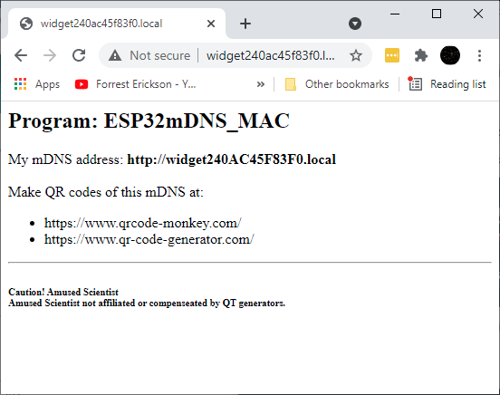

# ESP32mDNS_MAC

ESP32mDNS_MAC
   Forrest Erickson  
   Date: 20210519  
   License / Dedication: Public domain, Free to good home.  
   Warranty: This program will kill you but is not guarenteed to do so.  

   Reads the ESP32 chip ID and puts it into the form of a MAC address.
   Composes a unique mDNS domain name composed of the PRODUCT_NAME and the MAC
   Reports unique mDNS domain name on serial port
   Serves a web page with the mDNS and suggests making a QT code of same.
   Winks LED

   NOTE: the mDNS tested by me to work on Windows 10, and iPhone and 
   acording to the intertubes works on MAC and Linux. 
   However it did not work on Androide Galaxy 7 which is expected 
   acourding to the intertubes.

   IMPORTANT: Set your own router credential
   
Screen shot of served web page  

